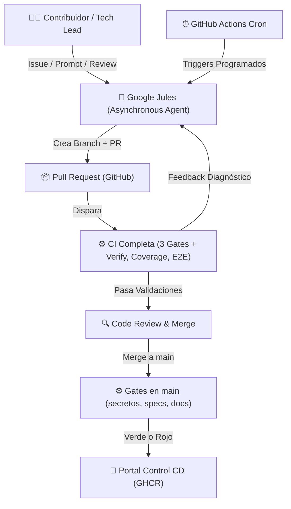

# 🌐 Portal Control Interno (Server.lab)

Esta es la configuración de despliegue para el **Portal Control**, integrado en la infraestructura de **Server.lab**.

## 1. Arquitectura de Despliegue

Este servicio se despliega como un Stack en **Server.lab** con la siguiente topología:

- **Public Link:** `https://portal.tu-dominio.com`
- **Ingress Proxy:** Caddy -> gateway (Nginx Custom Build)
- **Servicios Internos:**
  - `gateway`: Gateway de la aplicación (Construido vía `nginx/Dockerfile`).
  - `frontend`: Aplicación React/Vite.
  - `backend`: API Node.js/Prisma.
  - `db`: PostgreSQL 18.4.
  - `pgbouncer`: Gestor de conexiones a BD.

## 2. Configuración de Entorno

### 2.1 Variables de Portainer

Para mayor seguridad y compatibilidad GitOps, las variables de entorno se gestionan directamente en **Portainer (Stacks -> Environment Variables)**. No se requieren archivos físicos `.env` o `backend.env` en el servidor:

1.  **Variables Críticas**:
    - `DB_PASSWORD`: Clave de PostgreSQL.
    - `JWT_SECRET`: Secreto para tokens (mínimo 32 caracteres).
    - `DIRECT_URL`: URL de conexión directa para migraciones Prisma.
    - `DATABASE_URL`: URL de conexión vía PgBouncer para el runtime.
    - `SEED_ADMIN_PASSWORD`: Requerido en producción con DB fresca (sin
      default desde ADR-0011; el seed falla explícito si falta).
    - `ALLOWED_ORIGINS`: Lista separada por comas. Solo esos orígenes
      tienen CORS (ADR-0011); `*` abre sin credenciales.
2.  **Opcionales**:
    - `EMAIL_*`: Configuración SMTP.
    - `PORT`: Puerto interno (default 4000).
    - `BACKUP_HOST_PATH`: ruta persistente del host para respaldos. Recomendado: `/srv/server-lab/data/portal-control/backups`.
    - `UPLOADS_HOST_PATH`: ruta persistente del host para uploads. Recomendado: `/srv/server-lab/data/portal-control/uploads`.

## 3. Despliegue GitOps (Portainer + GHCR)

1.  Usa el archivo `compose.yaml` como manifiesto principal.
2.  GitHub Actions construye y publica las imágenes en `ghcr.io` para `backend`, `frontend` y `gateway`.
3.  Portainer debe desplegar el stack usando esas imágenes prebuild, no `build:` en el servidor.
4.  El portal se integra automáticamente a la red `proxy_net`.

### 3.1 Variables recomendadas para Portainer

- `IMAGE_TAG`: tag a desplegar. Default recomendado: `latest` para `main`.
- `BACKEND_IMAGE`: opcional; por defecto `ghcr.io/zer0x25/portal-control-2-0-backend`
- `FRONTEND_IMAGE`: opcional; por defecto `ghcr.io/zer0x25/portal-control-2-0-frontend`
- `GATEWAY_IMAGE`: opcional; por defecto `ghcr.io/zer0x25/portal-control-2-0-gateway`
- `BACKUP_HOST_PATH`: opcional; por defecto `/srv/server-lab/data/portal-control/backups`
- `UPLOADS_HOST_PATH`: opcional; por defecto `/srv/server-lab/data/portal-control/uploads`

### 3.2 Flujo recomendado

1.  Cambios locales en este repo.
2.  `commit` + `push` a GitHub.
3.  GitHub Actions valida, builda y publica imágenes.
4.  Portainer hace redeploy del stack usando el nuevo tag.

### 3.3 Convención de commits

Para que `release-please` pueda generar changelog, tags y releases automáticos, los commits deben seguir **Conventional Commits**:

- Formato: `tipo(scope opcional): mensaje corto`
- Ejemplo: `feat(auth): add MFA recovery flow`
- Ejemplo: `fix(employees): allow employee creation without status`
- Ejemplo: `ci(actions): split CI and CD workflows`

Tipos recomendados:

- `feat`: nueva funcionalidad
- `fix`: corrección de bug
- `docs`: documentación
- `refactor`: refactor sin cambio funcional esperado
- `test`: tests
- `build`: Docker, dependencias o empaquetado
- `ci`: workflows, pipelines y automatizaciones
- `chore`: mantenimiento menor

Cambios incompatibles deben marcarse explícitamente:

- `feat!: replace legacy employee sync model`
- o incluir `BREAKING CHANGE:` en el cuerpo del commit

## 4. Estándar de Integración

- **Red:** Conectado a `proxy_net` (externa).
- **Logs:** Configurados con rotación (10MB, max 3 archivos).
- **Persistencia:** Datos almacenados en el volumen Docker `postgres_data`.
- **Backups:** Deben escribirse en una ruta fija del host, fuera de `/data/compose/<stack-id>/`, para evitar dependencia del workspace interno de Portainer.
- **Uploads:** Los archivos cargados por la aplicación, incluido `company-policy`, deben persistirse en una ruta fija del host para sobrevivir a redeploys y recreación de contenedores.

## 5. Desarrollo Local

En el flujo diario, Docker ejecuta solo PostgreSQL. El backend Express y el frontend Vite corren en el host con recarga en caliente:

1. Crea `backend/.env` a partir de `backend/.env.example`; las URLs locales apuntan a `localhost:5433/pweb3_dev`.
2. Ejecuta `npm run dev:up` desde la raíz para iniciar PostgreSQL.
3. La primera vez, desde `backend/`, ejecuta `npx prisma generate`, `npm run db:migrate:deploy` y `npx prisma db seed`.
4. En una terminal, ejecuta `cd backend && npm run dev`.
5. En otra terminal, ejecuta `cd frontend && npm run dev`.
6. Abre `http://localhost:5173`; Vite redirige `/api` y `/socket.io` a `http://localhost:4000`.

### 5.1 Base de datos local

`compose.db.dev.yaml` publica PostgreSQL 18.4 en el puerto `5433` y conserva sus datos en un volumen Docker. `DB_USER`, `DB_PASSWORD`, `DB_NAME` y `DB_HOST_PORT` pueden cambiarse desde el `.env` de la raíz; mantén las URLs de `backend/.env` sincronizadas.

Dos particularidades de PostgreSQL 18 que ya están resueltas en el manifiesto:

- El volumen se monta en `/var/lib/postgresql`, no en `/var/lib/postgresql/data`. La imagen oficial de PG 18+ usa `PGDATA=/var/lib/postgresql/18/docker` y su entrypoint aborta si detecta el montaje heredado.
- La autenticación es `scram-sha-256` (no `md5`, que quedó deprecado en PG 18).

```bash
npm run dev:up
npm run dev:down
```

`npm run dev:down` detiene el contenedor y conserva el volumen. No uses `down -v` salvo que quieras borrar los datos locales.

### 5.2 Staging local (ensayo del deploy de producción)

`compose.staging.yaml` replica la topología de producción (`db` → `pgbouncer` → `backend` → `frontend` → `gateway`, `NODE_ENV=production`) en tu máquina, construyendo las imágenes con los Dockerfiles de producción. Está aislado de dev y de prod: proyecto Compose `portal-control-staging`, volúmenes, red y base de datos (`pweb3_staging`) propios, sin `proxy_net` ni rutas `/srv/...`.

|                  | **Dev**                                     | **Staging local**                           | **Producción**        |
| ---------------- | ------------------------------------------- | ------------------------------------------- | --------------------- |
| Manifiesto       | `compose.db.dev.yaml`                       | `compose.staging.yaml`                      | `compose.yaml`        |
| Proyecto Compose | `portal-control-localdb`                    | `portal-control-staging`                    | (Portainer)           |
| Imágenes         | PostgreSQL en Docker; apps en host          | build `Dockerfile` de prod                  | GHCR `sha-*` prebuild |
| `NODE_ENV`       | `development`                               | `production`                                | `production`          |
| Base de datos    | `pweb3_dev` directa (host `5433`)           | `pweb3_staging` vía PgBouncer (host `5434`) | `pweb3` vía PgBouncer |
| Acceso           | `:5173` (Vite), `:4000` (API), `:5433` (DB) | `http://localhost:8080` (gateway)           | dominio vía Caddy     |
| Secretos         | defaults de dev                             | obligatorios en `.env.staging`              | Portainer             |

```bash
cp .env.staging.example .env.staging   # completar JWT_SECRET y SEED_ADMIN_PASSWORD
npm run staging:up                     # build + arranque en segundo plano
npm run staging:logs
npm run staging:down                   # conserva datos; añadir -v al comando para borrarlos
```

Notas:

- Usa siempre `--env-file .env.staging` (los scripts `npm run staging:*` ya lo hacen) para no mezclar el `.env` de dev.
- Dev y staging pueden correr a la vez: no comparten puertos ni volúmenes.
- Si `ALLOWED_ORIGINS`/`STAGING_PORT` cambian, mantenlos coherentes (el origen debe coincidir con la URL del gateway).
- Atajos de dev: `npm run dev:up` / `npm run dev:down`.

## 6. Preparación en WSL

Si vas a levantar el stack desde WSL, prepara el entorno Linux dentro de la propia distro:

1. Instala Docker Engine y el plugin de Compose en WSL, o usa la integración de Docker Desktop con la distro si ya la tienes habilitada.
2. Asegúrate de poder ejecutar `docker compose version` desde la terminal de WSL.
3. Mantén este repositorio dentro del sistema de archivos de WSL, por ejemplo en `/home/...`, no en `/mnt/c/...`, para evitar problemas de rendimiento con los bind mounts.
4. Verifica que tu usuario tenga permisos sobre Docker antes de levantar el stack.
5. Arranca PostgreSQL con `npm run dev:up`; ejecuta Vite y Express en terminales separadas desde `frontend/` y `backend/`.

### 6.1 Comprobación rápida

```bash
docker version
docker compose version
```

### 6.2 Si Docker no está disponible en WSL

En ese caso tienes dos caminos:

1. Habilitar Docker Desktop con integración WSL para la distro actual.
2. Instalar Docker Engine directamente dentro de WSL y arrancar el servicio según la configuración de tu distro.

---

## 7. 🤖 Arquitectura y Gobernanza Agéntica (Agentic Workflow)

Este repositorio implementa el estándar moderno de **desarrollo colaborativo asistido por agentes autónomos de IA** (incluyendo Google Jules, Claude Code, Cursor/Windsurf y Antigravity).

### 7.1 Ecosistema de Agentes y Automatización



La validación completa ocurre en el PR. En `main` solo corren los gates
de gobernanza (secretos, specs, docs) sobre el commit que se va a
publicar, porque la batería pesada ya se ejecutó sobre ese mismo
código durante la revisión del PR. El reparto, la evidencia medida y las
consecuencias están en
[ADR-0013](./docs/adr/0013-ci-pr-full-deploy-main-gates.md).

### 7.2 Diarios de Memoria Institucional (`.jules/`)

Los modelos de lenguaje resetean su contexto entre sesiones. Para garantizar que los aprendizajes arquitectónicos y de seguridad persistan entre tareas autónomas, el repositorio utiliza diarios de memoria versionados:

- **`.jules/bolt.md` (Performance Journal):**
  Registra patrones de optimización, prevención de consultas N+1 en Prisma ORM y técnicas de batch-fetching requeridas para el motor de turnos y marcajes.
- **`.jules/sentinel.md` (Security Journal):**
  Registra restricciones de seguridad críticas: prevención de inyección de comandos en `child_process`, parametrización estricta de PostgreSQL con `set_config`, prohibición de secretos hardcodeados y validación integral de lotes masivos.

### 7.3 Estándar `AGENTS.md`

El archivo [`AGENTS.md`](./AGENTS.md) en la raíz del repositorio define la especificación canónica para agentes de IA:

- Comandos deterministas de instalación y validación (`npm ci`, `npx prisma generate`, `npm run validate:ci`).
- Restricciones de base de datos (PgBouncer en `transaction mode`, transacciones directas vía `withDirectTransaction`).
- Reglas de calidad y estilo de código.

### 7.4 Tareas Programadas Autónomas (`jules-scheduled.yml`)

El repositorio cuenta con mantenimiento preventivo continuo orquestado mediante GitHub Actions y la API REST de Google Jules:

| Día / Horario           | Agente             | Misión                                                                                |
| :---------------------- | :----------------- | :------------------------------------------------------------------------------------ |
| **Lunes 08:00 UTC**     | 🛡️ **Sentinel**    | Auditoría integral de seguridad, validación de endpoints y prevención de inyecciones. |
| **Miércoles 08:00 UTC** | ⚡ **Bolt**        | Detección y refactorización de consultas N+1 y mutaciones lentas en Prisma.           |
| **Viernes 18:00 UTC**   | 🧹 **Code Health** | Limpieza de `console.log` de depuración y eliminación de tipos `any`.                 |

### 7.5 Gates de CI (spec 003, ADR-0012)

Además de `verify-backend` / `verify-frontend`, cada PR/push pasa:

| Job                | Qué blinda                                                      | Cómo correrlo en local                                   |
| :----------------- | :-------------------------------------------------------------- | :------------------------------------------------------- |
| `coverage-ratchet` | La cobertura no baja (ratchet)                                  | `npm run test:coverage` en cada paquete                  |
| `docs-check`       | Sin links rotos en `docs/adr/`/`specs/`, ADR indexado, Prettier | `npm run docs:check` (raíz)                              |
| `e2e-smoke`        | El stack levanta y el login funciona                            | `npx playwright test e2e/smoke.spec.ts` (en `frontend/`) |

Umbrales de cobertura (solo suben, ver ADR-0012): backend líneas 14 / funciones 17 / ramas 8 / statements 14; frontend líneas 17 / funciones 35 / ramas 60 / statements 17.

---

_Documentación operativa y estándar agéntico - Actualizado: Octubre 2026_
