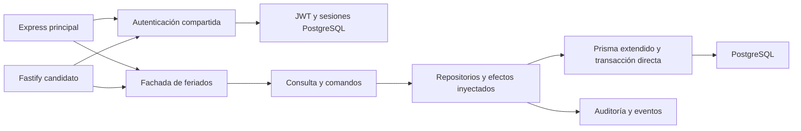

# Resultado 008: Base Fastify y feriados completos

Fecha: 2026-10-06. Node 26.10.0. Entrega local, sin despliegue ni cambio del
servidor principal. [PRD](./spec.md), [SDD](./plan.md), [BDD](./behavior.md),
[tareas](./tasks.md) y [medición JSON](./benchmark.json).

## Implementación

`buildFastifyApp` construye HTTP sin listen, jobs ni sockets. La composición real
está en `backend/src/fastify/runtime.ts`; `main.ts` configura puerto y escucha.
Fastify candidato expone health/ready y GET, POST, POST bulk, POST sync y DELETE
de feriados. Express continúa con el catálogo completo de la aplicación.

Base con CORS allowlist sin credenciales, helmet, compresión, body global 1 MiB,
bulk 10 MiB, rate limit antes del gate de mantenimiento, errores compartidos,
logging estructurado y cierre explícito de Prisma y sus pools externos de pg.
Health queda fuera de límites y mantenimiento. Arranque falla sin JWT_SECRET.
Logs omiten query de URL y auditoría elimina token de query.

Autenticación compartida entre Express/Fastify: verificación real de JWT,
hash de token, sesión vigente, rol persistido y actividad best effort. Se
conservan excepción de sesión Kiosk_Employee y duraciones existentes. El contexto
AsyncLocalStorage se crea por petición; Prisma extendido y `withDirectTransaction`
conservan actor y variables SQL. También se atribuye contexto al kiosco.

El módulo extrae consulta y comandos sin framework, DB, red o reloj global.
Repositorios reciben el cliente extendido existente; proveedor Boostr valida toda
la respuesta antes de escribir. Se conservan tipos Nacional/Regional del proveedor,
audit/eventos, orden secuencial de sync y semántica parcial ante fallo DB de bulk.
La fachada legacy delega; no abre pools adicionales. Zod valida peticiones y los
schemas de respuesta Fastify compilan serializadores. strict cubre auth, feriados
y plataforma HTTP; el legado restante conserva su configuración de tipos.

## Verificación

- TDD: 15 pruebas de comandos/auth fallaron primero con capacidad no implementada;
  las 15 pasaron tras implementación. Las pruebas HTTP detectaron el orden del
  limitador y el mapping 429, corregidos antes del cierre.
- Backend `validate:ci`: PASS, 0 errores/0 warnings ESLint, tipos normales/estrictos,
  SDK sin drift, schemas y build bajo Node 26.
- Backend coverage: **223/223 tests, 35 archivos**. Líneas 22,28%, statements 21,77%,
  funciones 28,02%, ramas 16,08%; ratchets sin cambios. Aplicaciones auth, consulta
  y comandos de feriados tienen 100% de líneas cubiertas (ramas no todas al 100%).
- Integración específica: **6/6 tests** en PostgreSQL 18.4 desechable con las
  12 migraciones reales. JWT/sesión/rol persistido, equivalencia GET con Express,
  bulk/delete/sync, errores, eventos, token query redactado y actor concurrente.
  Un trigger temporal comprobó `audit.username` dentro de la transacción SQL;
  se comprobaron también ambas capas de auditoría. Se eliminó la BD al terminar.
- Frontend `validate:ci:coverage`: **276/276 tests, 71 archivos**, tipos/lint/coverage/
  build PASS. React/Vite/PostgreSQL no cambian.
- Docker backend Node 26 Alpine: instalación limpia, codegen y build PASS; imagen
  exportada/cargada. Smoke compilado: cinco rutas, rechazo 401 sin token, cierre
  de recursos, Node 26.10.0. No conecta a DB en este smoke.
- Arranque compilado sin JWT_SECRET: rechazo explícito PASS.
- Spec/docs/format/diff y secret scan: PASS. La integración queda en CI backend;
  esa ejecución remota aún no se ha realizado.

## Comparación HTTP

Carga: GET paginado autenticado; JWT + sesión + usuario + list/count Prisma.
500 filas, página de 50, 16 peticiones concurrentes, 100 de calentamiento y 600
medidas por ejecución. Tres ejecuciones por servidor, orden alternado y procesos
nuevos. Cliente de carga separado del servidor; CPU/RSS del servidor únicamente.
PostgreSQL directo en Docker, logging de acceso desactivado, RSS muestreado cada
20 ms. 3.600 peticiones medidas, 0 errores HTTP/contrato. Sin CI/build simultáneos
realizados por esta tarea durante la medición final.

Medianas de las tres ejecuciones (p95 es mediana de percentiles por ejecución):

| Métrica                     | Express | Fastify candidato |
| --------------------------- | ------: | ----------------: |
| Peticiones/s                |  366.36 |            387.12 |
| p95 (ms)                    |   55.42 |             52.84 |
| CPU por 600 peticiones (ms) | 1870.09 |           1944.13 |
| Pico RSS (MiB)              |  362.94 |            330.75 |

La diferencia de velocidad es pequeña y los rangos p95 se solapan: Express
48,8–65,8 ms, Fastify 51,9–68,0 ms. No demuestra una mejora estable ni capacidad
productiva. CPU ligeramente mayor en la mediana Fastify. El menor RSS compara un
Express con todos sus módulos frente a un candidato con health/feriados; no se
atribuye esa diferencia al framework. El beneficio demostrado en esta entrega
es aislamiento, tipos, contratos y pruebas con infraestructura real.

## Uso y siguiente entrega

Desde backend con Node 26: `PORT=4001 npm run dev:fastify`, o tras build
`PORT=4001 npm run start:fastify`. Requiere conexiones y JWT_SECRET existentes;
login HTTP permanece en Express y comparte firma/sesiones con el candidato.
`npm run test:fastify:integration` y `npm run benchmark:fastify` crean BD propia,
sin reutilizar conexiones de entorno; requieren Docker.

Pendientes para el cambio definitivo: rutas HTTP de auth, módulos restantes,
jobs y sockets operativos, integración Sentry, catálogo completo de OpenAPI desde
Fastify y staging/e2e con PgBouncer/gateway. El Swagger/SDK actual sigue siendo
canónico y conserva su generación legacy. No se ejecutó staging porque este
checkout no contiene `.env.staging`; la BD de prueba no sustituye ese entorno.
