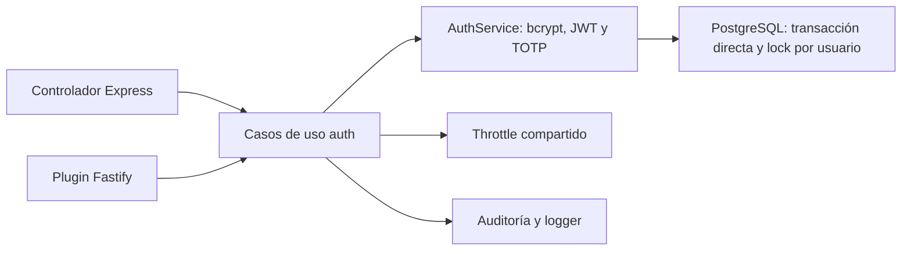

# Resultado — Autenticación HTTP en Fastify

Las seis rutas de `/api/auth` ya funcionan en el candidato Fastify. Express
continúa como servidor principal y delega la misma orquestación. No hay cambios
al esquema PostgreSQL ni al contrato público del SDK.

## Entrega

| Ruta POST              | Protección                          | Comportamiento conservado                                         |
| ---------------------- | ----------------------------------- | ----------------------------------------------------------------- |
| /api/auth/login        | Pública + throttle por IP/identidad | Credenciales, archived, desafío MFA o sesión                      |
| /api/auth/kiosk-login  | Pública + mismo throttle            | PIN, bloqueo, token de 5 min sin sesión                           |
| /api/auth/logout       | Pública, cuerpo ignorado            | Revocación por header, 200 idempotente, actor anónimo             |
| /api/auth/mfa/setup    | JWT + sesión persistida             | QR real, secreto, MFA inicialmente deshabilitado; cuerpo ignorado |
| /api/auth/mfa/verify   | JWT + sesión persistida             | Código requerido, TOTP, activación y auditoría                    |
| /api/auth/mfa/validate | Pública, desafío firmado            | Código de seis caracteres, segunda fase y sesión                  |

- Casos de uso con dependencias inyectadas en `backend/src/modules/auth/application/flows.ts`.
- Composición en `backend/src/services/authFlows.ts`; adapter Express en `backend/src/controllers/authController.ts` y Fastify en `backend/src/modules/auth/http/routes.ts`.
- Throttle independiente de Express en `backend/src/services/loginFailures.ts`; ambos transportes conservan claves, límites y Retry-After. Login/kiosk usan 5 puntos en producción y 30 fuera de producción; no se cuenta un login exitoso como falla.
- Respuestas Fastify serializadas con DTOs explícitos; setup/logout documentan la excepción de cuerpo ignorado. Validación Zod comparte los schemas de entrada existentes.
- Guard de manifiesto comprueba seis rutas exactas, clasificación pública/protegida y validadores; también conserva las cinco de feriados.
- AST guard exige API pública index.ts y aplicación sin servidor, DB, entorno o reloj global. El único import externo permitido en aplicación auth es el utilitario puro de errores compartidos.
- AuthService conserva bcrypt/JWT/TOTP y persistencia. La creación de sesiones mantiene advisory lock, insert y trim dentro de withDirectTransaction; no se mueve al pool de PgBouncer.
- Los intentos de login usan logger estructurado; no se escriben credenciales.

## Corrección explícita

La auditoría de errores omitía el cuerpo solo si la categoría era AUTH_ERROR.
Un fallo inesperado en login podía persistir password, PIN, código o mfaToken.
Ahora omite el cuerpo de todas las rutas `/api/auth/`, cualquiera sea la categoría.
La integración fuerza el fallo y comprueba el metadata real de Express y Fastify.

## Verificación

- TDD: 13 pruebas de orquestación fallaron con el stub antes de implementar;
  después pasaron. Se agregaron tres casos de defaults/fallos de dependencias.
- Suite backend con cobertura: **268 pruebas**, 38 archivos, aprobadas. La nueva
  orquestación tiene 100% de líneas/funciones y 83.92% de ramas. Cobertura total:
  líneas 23.98%, funciones 29.89%, ramas 17.8%, statements 23.5%; ratchets intactos.
- Integración desechable: **27/27 pruebas**, seis archivos; incluye 16 nuevas
  de auth, seis de feriados y cinco regresiones originales de auth/sesiones.
- Backend validate:ci: aprobado; tipos globales y módulos strict, cero lint,
  SDK sincronizado, nueve pruebas de schemas y build.
- Frontend validate:ci:coverage: **276/276 pruebas**, 71 archivos; tipos,
  formato, cero lint, cobertura, build Vite y PWA aprobados.
- Docs: 59 Markdown y 18 ADR; spec gate: nueve specs. Escaneo de secretos:
  cero secretos, 11 coincidencias permitidas. git diff --check y SDK sin diff.
- Docker Node 26: build aprobado; smoke del candidato compilado enumera seis
  rutas auth y devuelve 401 en MFA setup sin token (Node v26.10.0).

Las pruebas de integración nuevas usan bcrypt, JWT firmado, QR/TOTP, Prisma y
PostgreSQL 18.4 reales. Comparan cuerpos/códigos con Express, comprueban hashes
persistidos, token revocado, sesión expirada, límites bajo concurrencia
(Usuario 1, Reloj_Control 2, Administrador 10), TTL Usuario de 108 segundos,
quiosco de 300 segundos y bloqueo de PIN tras cinco fallas. La misma ejecución
incluye las cuatro suites originales de auth/sesiones Express como regresión.
El runner crea y elimina una BD propia sin reutilizar URLs del entorno.

## Alcance y pendientes

No se cambia el servidor principal ni se hace deploy. Purga administrativa de
sesiones pertenece al módulo admin; falta migrar módulos restantes, jobs,
sockets y la fuente OpenAPI antes del cambio definitivo. La validación con
PgBouncer/gateway/staging no se ejecutó: falta `.env.staging`.

Se conservan y documentan riesgos heredados: MFA no rechaza de nuevo al usuario
archivado entre factores; `/mfa/validate` no tiene throttle de intentos de código
(aplica el límite global); el contador PIN no es atómico bajo fallas concurrentes;
y los limitadores en memoria no se comparten entre procesos. Conviene tratar
estas políticas en una entrega de seguridad con contratos y pruebas propios.

El benchmark de spec 008 es histórico y anterior a estas rutas. No se extrapola
su resultado ni se declara una mejora de rendimiento de esta entrega.

## Reproducir

Desde backend, con Node 26: npm run validate:ci, npm run test:coverage y
npm run test:fastify:integration. Desde frontend: npm run validate:ci:coverage,
después del backend (check:sdk escribe el SDK). Desde raíz: npm run spec:check,
npm run docs:check y npm run secrets:scan.

Las pruebas de B1–B7 y B9 están en
`backend/tests/fastify-integration/auth.test.ts`; B8 también en
`backend/tests/unit/loginFailures.test.ts`; B10 en
`backend/tests/unit/fastifyRouteContracts.test.ts`. Validación HTTP y cuerpos
ignorados se ejercitan en `backend/tests/unit/authHttp.test.ts`; reglas sin DB
en `backend/tests/unit/authFlows.test.ts` y límites de módulos en
`backend/tests/holidays-architecture.test.ts`.
